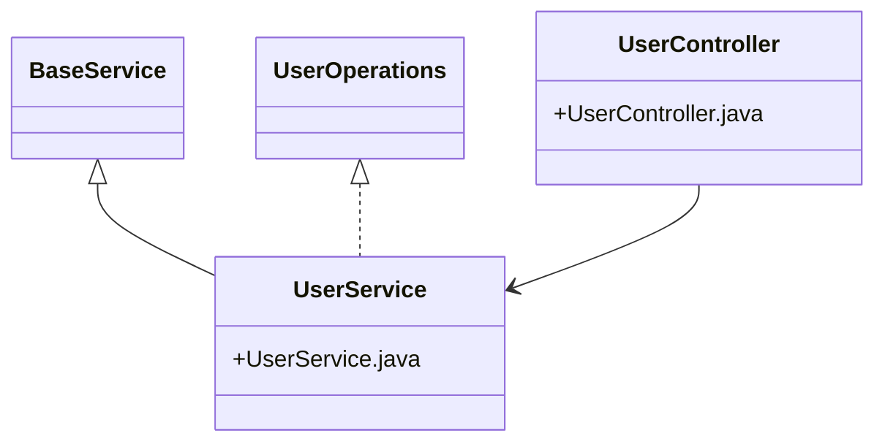
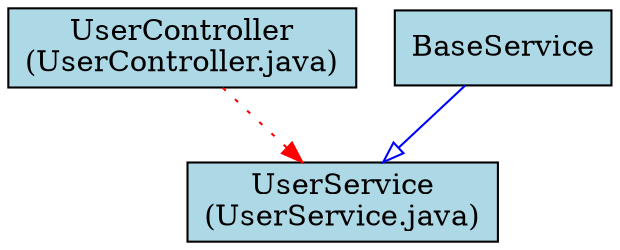

# CodeComprehender

An automated tool for analyzing Java codebases that generates JavaDoc comments and architecture diagrams using AI.

## What it does

- **Parses Java files** and extracts methods and class structures
- **Generates JavaDoc comments** for methods and classes using OpenAI GPT
- **Creates architecture reports** showing class relationships and dependencies
- **Generates visual diagrams** in Mermaid and Graphviz formats
- **Processes files in parallel** for faster execution
- **Creates commented copies** without modifying original files

## Installation

```bash
pip install -r requirements.txt
```

Create a `.env` file with your OpenAI API key:
```
OPENAI_API_KEY=your_api_key_here
```

## Basic Usage

```bash
python main.py --repo /path/to/java/project
```

This will:
1. Copy your Java project to `output/project_commented/`
2. Add JavaDoc comments to all Java files
3. Create `ClassName_commented.java` files with generated comments

## Command Options

```bash
# Basic commenting
python main.py --repo /path/to/java/project --out output_folder

# Generate architecture report (markdown)
python main.py --repo /path/to/java/project --arch-report

# Generate visual diagrams (Mermaid + Graphviz)
python main.py --repo /path/to/java/project --visual

# Print architecture to console
python main.py --repo /path/to/java/project --architecture

# Control parallel processing (default: 4 workers)
python main.py --repo /path/to/java/project --workers 8

# Combine multiple options
python main.py --repo /path/to/java/project --arch-report --visual --out results
```

## Generated Output

### 1. Commented Java Files

**Original:**
```java
public boolean deleteUser(String id) {
    return userRepository.delete(id);
}
```

**Generated:**
```java
/**
 * Deletes a user by ID.
 *
 * @param id ID of the user
 * @return True if deleted
 */
public boolean deleteUser(String id) {
    return userRepository.delete(id);
}
```

### 2. Architecture Report (`project_architecture.md`)

```markdown
# Project Architecture

## `UserService`
- File: `src/main/java/com/example/UserService.java`
- Extends: `BaseService`
- Implements: `UserOperations`, `Auditable`
- Key Imports: `com.example.repository.UserRepository`

## `UserController`
- File: `src/main/java/com/example/UserController.java`
- Key Imports: `com.example.service.UserService`

---
**Total Classes**: 15
**Classes with Inheritance**: 8
**Classes with Interfaces**: 5
```

### 3. Visual Diagrams

**Mermaid Diagram** (`project_architecture_mermaid.md`):


**Graphviz DOT file** (`project_architecture.dot`):


## Output Structure

```
output/
├── project_commented/              # Commented Java files
│   ├── src/
│   │   ├── ClassName.java         # Original
│   │   └── ClassName_commented.java # With comments
│   └── ...
├── project_architecture.md        # Architecture report
├── project_architecture_mermaid.md # Mermaid diagram
└── project_architecture.dot       # Graphviz file
```

## Error Handling

- Skips files that can't be parsed
- Falls back to copying original files if comment generation fails
- Shows progress and error counts during processing

## Requirements

- Python 3.8+
- Java source files (.java)
- OpenAI API key
- Dependencies listed in `requirements.txt`