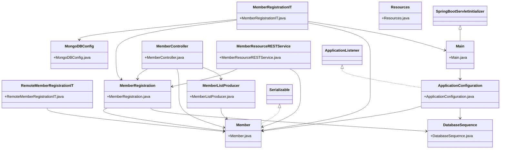

# Architecture Diagram

```mermaid
classDiagram
    class RemoteMemberRegistrationIT {
        +RemoteMemberRegistrationIT.java
    }
    class MemberRegistrationIT {
        +MemberRegistrationIT.java
    }
    class MongoDBConfig {
        +MongoDBConfig.java
    }
    class Main {
        +Main.java
    }
    class ApplicationConfiguration {
        +ApplicationConfiguration.java
    }
    class Resources {
        +Resources.java
    }
    class MemberController {
        +MemberController.java
    }
    class Member {
        +Member.java
    }
    class DatabaseSequence {
        +DatabaseSequence.java
    }
    class MemberRegistration {
        +MemberRegistration.java
    }
    class MemberListProducer {
        +MemberListProducer.java
    }
    class MemberResourceRESTService {
        +MemberResourceRESTService.java
    }

    SpringBootServletInitializer <|-- Main
    ApplicationListener <|.. ApplicationConfiguration
    Serializable <|.. Member

    RemoteMemberRegistrationIT --> Member
    MemberRegistrationIT --> Main
    MemberRegistrationIT --> Member
    MemberRegistrationIT --> MemberRegistration
    MemberRegistrationIT --> MongoDBConfig
    Main --> ApplicationConfiguration
    ApplicationConfiguration --> DatabaseSequence
    ApplicationConfiguration --> Member
    MemberController --> MemberListProducer
    MemberController --> Member
    MemberController --> MemberRegistration
    MemberRegistration --> DatabaseSequence
    MemberRegistration --> Member
    MemberListProducer --> Member
    MemberResourceRESTService --> Member
    MemberResourceRESTService --> MemberRegistration
```