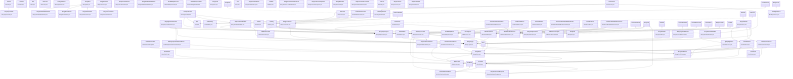

# Architecture Diagram

```mermaid
classDiagram
    class TestUtils {
        +TestUtils.java
    }
    class MongoSQLTestUtils {
        +MongoSQLTestUtils.java
    }
    class PrintUtils {
        +PrintUtils.java
    }
    class Main {
        +Main.java
    }
    class SmokeTest {
        +SmokeTest.java
    }
    class BsonTypeInfoTest {
        +BsonTypeInfoTest.java
    }
    class MongoMock {
        +MongoMock.java
    }
    class MongoDriverTest {
        +MongoDriverTest.java
    }
    class MongoConnectionTest {
        +MongoConnectionTest.java
    }
    class TestConnectionString {
        +TestConnectionString.java
    }
    class MongoJsonSchemaTest {
        +MongoJsonSchemaTest.java
    }
    class BsonUtilsTest {
        +BsonUtilsTest.java
    }
    class MongoDatabaseMetaDataTest {
        +MongoDatabaseMetaDataTest.java
    }
    class MongoSQLTranslateLibTest {
        +MongoSQLTranslateLibTest.java
    }
    class MongoStatementTest {
        +MongoStatementTest.java
    }
    class MongoResultSetTest {
        +MongoResultSetTest.java
    }
    class MongoResultSetMetaDataTest {
        +MongoResultSetMetaDataTest.java
    }
    class RFC8252HttpServerTest {
        +RFC8252HttpServerTest.java
    }
    class AuthX509IntegrationTest {
        +AuthX509IntegrationTest.java
    }
    class DCIntegrationTest {
        +DCIntegrationTest.java
    }
    class ADFIntegrationTest {
        +ADFIntegrationTest.java
    }
    class TestTypeInfo {
        +TestTypeInfo.java
    }
    class TestGenerator {
        +TestGenerator.java
    }
    class DataLoader {
        +DataLoader.java
    }
    class TestDataEntry {
        +TestDataEntry.java
    }
    class TestEntry {
        +TestEntry.java
    }
    class TestData {
        +TestData.java
    }
    class Tests {
        +Tests.java
    }
    class MongoListTablesResult {
        +MongoListTablesResult.java
    }
    class BuildInfo {
        +BuildInfo.java
    }
    class MongoRunCmdListTablesResult {
        +MongoRunCmdListTablesResult.java
    }
    class Pair {
        +Pair.java
    }
    class MongoConnectionProperties {
        +MongoConnectionProperties.java
    }
    class MongoDatabaseMetaData {
        +MongoDatabaseMetaData.java
    }
    class MongoResultSetMetaData {
        +MongoResultSetMetaData.java
    }
    class MongoBsonValue {
        +MongoBsonValue.java
    }
    class MongoSerializationException {
        +MongoSerializationException.java
    }
    class MongoResultSet {
        +MongoResultSet.java
    }
    class SortableBsonDocument {
        +SortableBsonDocument.java
    }
    class MongoDriver {
        +MongoDriver.java
    }
    class BsonExplicitCursor {
        +BsonExplicitCursor.java
    }
    class MongoPreparedStatement {
        +MongoPreparedStatement.java
    }
    class MongoJsonSchemaResult {
        +MongoJsonSchemaResult.java
    }
    class MongoVersionedJsonSchema {
        +MongoVersionedJsonSchema.java
    }
    class DataLake {
        +DataLake.java
    }
    class MongoStatement {
        +MongoStatement.java
    }
    class MongoFunctions {
        +MongoFunctions.java
    }
    class JsonSchema {
        +JsonSchema.java
    }
    class NoCheckStateJsonWriter {
        +NoCheckStateJsonWriter.java
    }
    class MongoColumnInfo {
        +MongoColumnInfo.java
    }
    class MongoJsonSchema {
        +MongoJsonSchema.java
    }
    class MongoConnection {
        +MongoConnection.java
    }
    class JdbcOidcCallbackContext {
        +JdbcOidcCallbackContext.java
    }
    class OidcTimeoutException {
        +OidcTimeoutException.java
    }
    class JdbcOidcCallback {
        +JdbcOidcCallback.java
    }
    class RFC8252HttpServer {
        +RFC8252HttpServer.java
    }
    class OidcAuthFlow {
        +OidcAuthFlow.java
    }
    class JdbcIdpInfo {
        +JdbcIdpInfo.java
    }
    class OidcResponse {
        +OidcResponse.java
    }
    class TestOidcUtils {
        +TestOidcUtils.java
    }
    class TestOidcAuthFlowAndRefresh {
        +TestOidcAuthFlowAndRefresh.java
    }
    class TestRFC8252Server {
        +TestRFC8252Server.java
    }
    class TestOidcAuthFlow {
        +TestOidcAuthFlow.java
    }
    class TestOidcCallbackWithBadRefreshToken {
        +TestOidcCallbackWithBadRefreshToken.java
    }
    class TestOidcCallback {
        +TestOidcCallback.java
    }
    class TestOidcCallbackWithShortTimeout {
        +TestOidcCallbackWithShortTimeout.java
    }
    class NativeLoader {
        +NativeLoader.java
    }
    class BsonUtils {
        +BsonUtils.java
    }
    class X509Authentication {
        +X509Authentication.java
    }
    class MongoSQLException {
        +MongoSQLException.java
    }
    class GetNamespacesResult {
        +GetNamespacesResult.java
    }
    class TranslateResult {
        +TranslateResult.java
    }
    class GetMongosqlTranslateVersionResult {
        +GetMongosqlTranslateVersionResult.java
    }
    class MongoSQLTranslate {
        +MongoSQLTranslate.java
    }
    class CheckDriverVersionResult {
        +CheckDriverVersionResult.java
    }
    class QueryDiagnostics {
        +QueryDiagnostics.java
    }
    class MongoLogger {
        +MongoLogger.java
    }
    class MongoSimpleFormatter {
        +MongoSimpleFormatter.java
    }

    TestUtils <|-- MongoSQLTestUtils
    MongoMock <|-- MongoConnectionTest
    MongoMock <|-- MongoStatementTest
    MongoMock <|-- MongoResultSetTest
    MongoMock <|-- MongoResultSetMetaDataTest
    DatabaseMetaData <|.. MongoDatabaseMetaData
    ResultSetMetaData <|.. MongoResultSetMetaData
    Exception <|-- MongoSerializationException
    ResultSet <|.. MongoResultSet
    BsonDocument <|-- SortableBsonDocument
    Comparable <|.. SortableBsonDocument
    Driver <|.. MongoDriver
    MongoCursor <|.. BsonExplicitCursor
    PreparedStatement <|.. MongoPreparedStatement
    Statement <|.. MongoStatement
    JsonWriter <|-- NoCheckStateJsonWriter
    Connection <|.. MongoConnection
    OidcCallbackContext <|.. JdbcOidcCallbackContext
    Exception <|-- OidcTimeoutException
    OidcCallback <|.. JdbcOidcCallback
    MongoCredential <|.. JdbcIdpInfo
    Exception <|-- MongoSQLException
    Formatter <|-- MongoSimpleFormatter

    TestConnectionString --> MongoDriver
    BsonUtilsTest --> BsonUtils
    MongoSQLTranslateLibTest --> MongoLogger
    MongoSQLTranslateLibTest --> GetMongosqlTranslateVersionResult
    MongoSQLTranslateLibTest --> MongoSQLException
    MongoSQLTranslateLibTest --> MongoSQLTranslate
    DCIntegrationTest --> MongoConnection
    DCIntegrationTest --> MongoDatabaseMetaData
    DCIntegrationTest --> Pair
    DCIntegrationTest --> MongoSQLException
    ADFIntegrationTest --> MongoConnection
    ADFIntegrationTest --> TestEntry
    TestGenerator --> MongoResultSetMetaData
    TestGenerator --> ADFIntegrationTest
    TestGenerator --> TestEntry
    DataLoader --> Pair
    DataLoader --> TestData
    DataLoader --> TestDataEntry
    MongoDatabaseMetaData --> MongoLogger
    MongoDatabaseMetaData --> MongoSQLException
    MongoResultSetMetaData --> MongoLogger
    MongoResultSetMetaData --> QueryDiagnostics
    MongoResultSet --> MongoLogger
    MongoDriver --> NativeLoader
    MongoPreparedStatement --> MongoLogger
    MongoStatement --> MongoLogger
    MongoStatement --> QueryDiagnostics
    MongoStatement --> GetNamespacesResult
    MongoStatement --> MongoSQLException
    MongoStatement --> MongoSQLTranslate
    MongoStatement --> TranslateResult
    MongoJsonSchema --> BsonUtils
    MongoConnection --> MongoLogger
    MongoConnection --> MongoSimpleFormatter
    MongoConnection --> MongoSQLException
    MongoConnection --> MongoSQLTranslate
    MongoConnection --> JdbcOidcCallback
    MongoConnection --> X509Authentication
    JdbcOidcCallback --> MongoLogger
    OidcAuthFlow --> MongoLogger
    TestOidcUtils --> JdbcIdpInfo
    TestOidcUtils --> OidcAuthFlow
    TestOidcAuthFlowAndRefresh --> JdbcOidcCallbackContext
    TestOidcAuthFlowAndRefresh --> OidcAuthFlow
    TestRFC8252Server --> OidcResponse
    TestRFC8252Server --> OidcTimeoutException
    TestRFC8252Server --> RFC8252HttpServer
    TestOidcAuthFlow --> JdbcOidcCallbackContext
    TestOidcAuthFlow --> OidcAuthFlow
    TestOidcCallbackWithBadRefreshToken --> JdbcOidcCallback
    TestOidcCallbackWithBadRefreshToken --> JdbcOidcCallbackContext
    TestOidcCallback --> JdbcOidcCallback
    TestOidcCallback --> JdbcOidcCallbackContext
    TestOidcCallbackWithShortTimeout --> JdbcOidcCallback
    TestOidcCallbackWithShortTimeout --> JdbcOidcCallbackContext
    TestOidcCallbackWithShortTimeout --> OidcTimeoutException
    NativeLoader --> MongoDriver
    BsonUtils --> MongoSerializationException
    BsonUtils --> NoCheckStateJsonWriter
    X509Authentication --> MongoLogger
    GetNamespacesResult --> MongoDriver
    GetNamespacesResult --> BsonUtils
    TranslateResult --> JsonSchema
    TranslateResult --> MongoDriver
    TranslateResult --> MongoJsonSchema
    TranslateResult --> BsonUtils
    GetMongosqlTranslateVersionResult --> MongoDriver
    GetMongosqlTranslateVersionResult --> BsonUtils
    MongoSQLTranslate --> MongoDriver
    MongoSQLTranslate --> MongoJsonSchema
    MongoSQLTranslate --> MongoJsonSchemaResult
    MongoSQLTranslate --> MongoSerializationException
    MongoSQLTranslate --> MongoLogger
    MongoSQLTranslate --> BsonUtils
    CheckDriverVersionResult --> MongoDriver
    CheckDriverVersionResult --> BsonUtils
    QueryDiagnostics --> MongoDriver
    QueryDiagnostics --> MongoJsonSchema
    QueryDiagnostics --> BsonUtils
    MongoLogger --> MongoJsonSchema
```